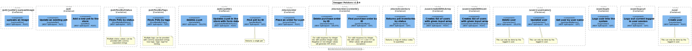
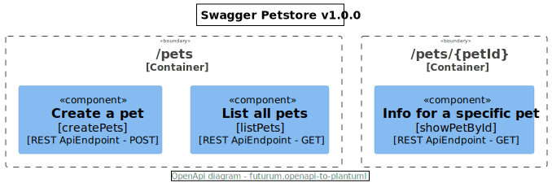

# Futurum.OpenApi to PlantUml


Creates [PlantUml](https://plantuml.com) diagrams from [OpenApi](https://www.openapis.org) spec files.

## Example 1
[OpenApi spec](./openapi/openapi-petstore.json) taken from [here](https://petstore.swagger.io)

### OpenApi diagram


### OpenApi Type diagram


## Example 2
[OpenApi spec](./openapi/openapi-petstore-simple.yaml)

### OpenApi diagram


### OpenApi Type diagram


## How to use it
### Console
Use *futurum.openapi-to-plantuml-console* project

#### File
Use *--file* followed by file path
```
--file "../../../../openapi/openapi-petstore.yaml"
```

#### Directory
Use *--directory* followed by directory path
```
--directory "../../../../openapi"
```

### Docker - Use with multiple OpenApi spec files

```
docker run --rm -it -v $(pwd)/openapi:/openapi futurum.openapi-to-plantuml-directory
```

### Docker - Use with individual OpenApi spec files
#### OpenApi diagram
```
cat ./openapi/openapi-petstore.json | docker run --rm -a stdin -a stdout -i futurum.openapi-to-plantuml-std-in-out-openapi |> ./openapi/openapi-petstore-openapi.puml
```
```
cat ./openapi/openapi-petstore-simple.yaml | docker run --rm -a stdin -a stdout -i futurum.openapi-to-plantuml-std-in-out-openapi |> ./openapi/openapi-petstore-simple-openapi.puml
```
#### OpenApi Type diagram
```
cat ./openapi/openapi-petstore.json | docker run --rm -a stdin -a stdout -i futurum.openapi-to-plantuml-std-in-out-openapi-type |> ./openapi/openapi-petstore-openapi-type.puml
```
```
cat ./openapi/openapi-petstore-simple.yaml | docker run --rm -a stdin -a stdout -i futurum.openapi-to-plantuml-std-in-out-openapi-type |> ./openapi/openapi-petstore-simple-openapi-type.puml
```

## Docker
### How to build it

```
docker build -t futurum.openapi-to-plantuml-directory -f futurum.openapi-to-plantuml-directory/Dockerfile .
```
```
docker build -t futurum.openapi-to-plantuml-std-in-out-openapi -f futurum.openapi-to-plantuml-std-in-out/Dockerfile-openapi .
```
```
docker build -t futurum.openapi-to-plantuml-std-in-out-openapi-type -f futurum.openapi-to-plantuml-std-in-out/Dockerfile-openapi-type .
```

### Remove images
```
docker rmi futurum.openapi-to-plantuml-directory
```
```
docker rmi futurum.openapi-to-plantuml-std-in-out-openapi
```
```
docker rmi futurum.openapi-to-plantuml-std-in-out-openapi-type
```